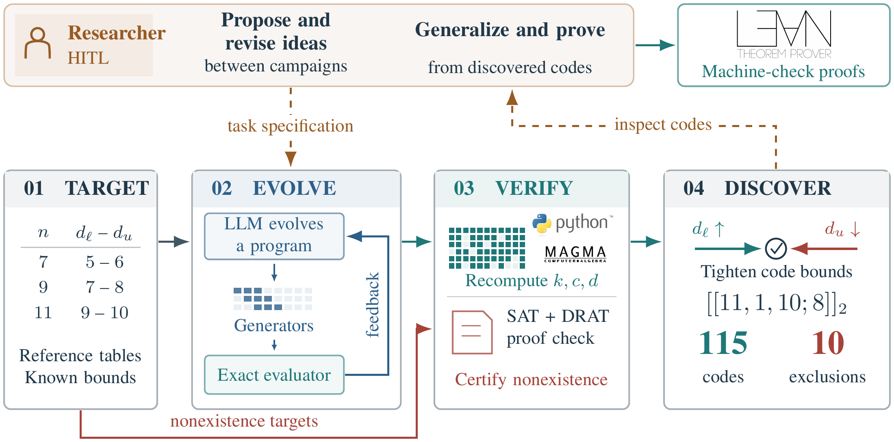
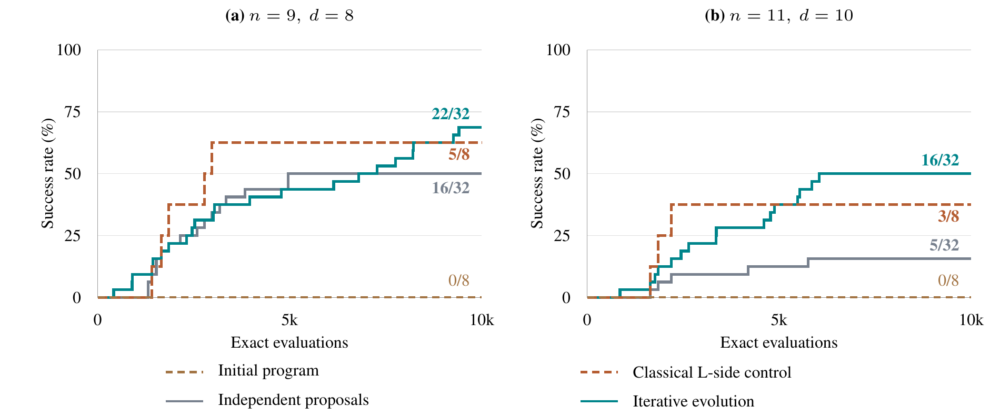
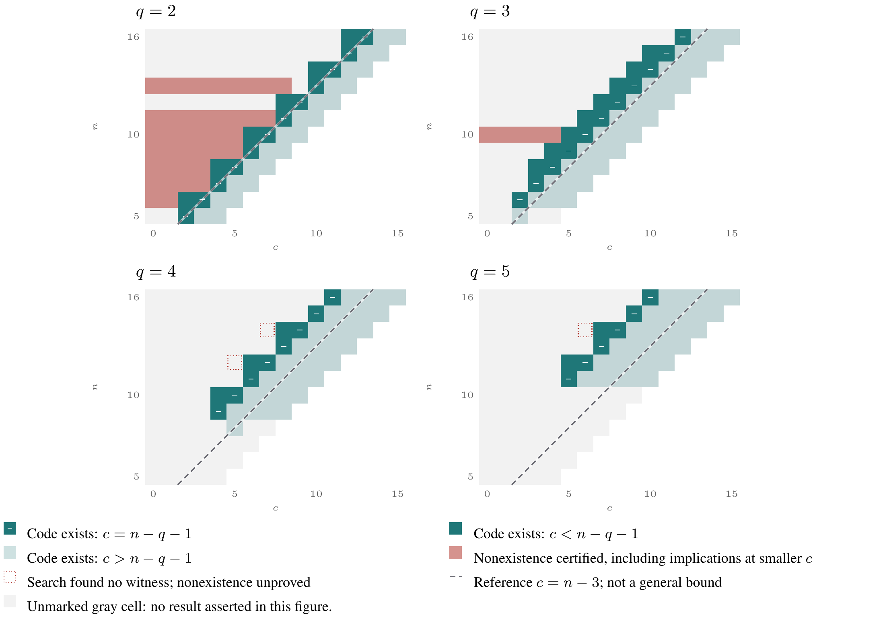
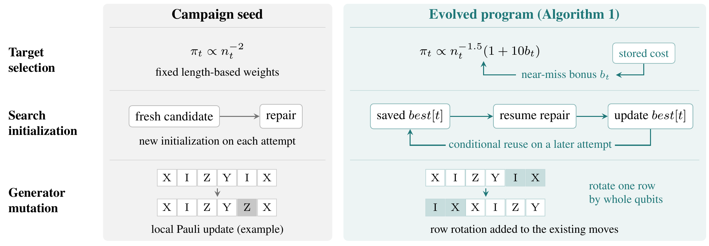

# LLM-guided discovery of entanglement-assisted quantum codes

A research pipeline in which evolved programs construct quantum codes,
researchers generalize their structure into mathematical results, and preserved
implementations and independent checks support reproduction.
This repository contains the paper, generated programs, complete controlled-study
records, codes, proof certificates and reproducibility tools.

[Paper](paper/iclr2027/paper/main.pdf) · [Start reproducing](docs/REVIEWER_GUIDE.md) · [Result-to-evidence map](docs/RESULTS_AND_EVIDENCE.md) · [Validation record](docs/VALIDATION.md) · [SAT & Magma setup](docs/EXTERNAL_VERIFICATION.md)

## The discovery pipeline

<p align="center">
  
</p>

Researchers supply mathematical directions, inspect verified codes and refine
the next task. The LLM evolves a search program; an exact evaluator supplies its
feedback. Independent code checks establish constructions, while checked SAT
certificates establish exclusions. The program, the code it constructs and the
proof of a bound are distinct outputs with distinct evidence.

## From finite constructions to a general theorem

The pipeline supports mathematical discovery through interaction between program
evolution and researcher analysis. The initial tasks supplied open code
parameters, exact evaluation and construction directions, but did not supply
the family formula. Evolved programs produced finite qubit constructions;
researchers used their structure to derive an infinite qubit family and then
extended the construction to other prime-power alphabets.

**Theorem 1** proves the family

$$
[[n,1,n-1;n-q-1]]_q,
$$

for prime powers $q\geq3$ and $n\geq2q+1$, and for $q=2$ at odd lengths
$n\geq5$. The family and ebit lifting close **54 previously listed gaps**.
The proof in Appendix A.2 establishes the result for all admissible parameters;
finite computations check its implemented instances.

| Stage | What changed | Evidence to inspect |
|---|---|---|
| Initial search | Researchers proposed construction directions; evolved programs produced finite qubit codes. | [Initial task](artifacts/campaigns/prompts/campaign1.txt), campaign records in Appendix B.1 |
| Mathematical generalization | Researchers derived the odd-length qubit family, then extended it to the prime-power construction. | Theorem 1 and its full proof in Appendix A.2; [family implementations](scripts/families/) |
| Further program evolution | Later tasks supplied the discovered qubit family and proposed further construction directions. | [Later task](artifacts/campaigns/prompts/campaign3.txt), Algorithm 1 |
| Controlled comparison | Both policies received the same proposal to search the symplectic dual; only iterative evolution used earlier generated programs and feedback. | [Shared task](experiments/hitl_ablation/task.txt), [study records](experiments/hitl_ablation/README.md) |

Appendix B.3 distinguishes researcher proposals, model tasks, exact feedback and
information withheld. Its text-first summaries also have standalone vector views:
[initial search](paper/iclr2027/task_specs/initial.svg),
[after generalization](paper/iclr2027/task_specs/updated.svg) and
[controlled study](paper/iclr2027/task_specs/controlled.svg).
The original task files remain unchanged.

**What can be reproduced.** Readers can verify supplied code matrices, generate
and check family instances, and replay preserved search programs with recorded
seeds and evaluation budgets. To check the implemented family and the 54 gap
closures, run:

```bash
python3 scripts/reproduce_eaqecc.py --claim families
```

Algorithm 1 is a later retained program whose seed already incorporated the
qubit family. The archive does not recreate the original model sampling or
identify a surviving program source for every early discovery. The
[result-to-evidence map](docs/RESULTS_AND_EVIDENCE.md) connects each claim to its
records and verification scope.

## What iterative development achieved

Both generation policies received the same initial program and the same direction
to search the symplectic dual. The comparison measures what changes when a new
proposal can use earlier programs and their evaluation feedback.

<p align="center">
  
</p>

| Held-out target | Initial program | Independent proposals | Iterative evolution |
|---|---:|---:|---:|
| Length 9, distance 8 | 0/8 (0%) | 16/32 (50.0%) | **22/32 (68.8%)** |
| Length 11, distance 10 | 0/8 (0%) | 5/32 (15.6%) | **16/32 (50.0%)** |
| Combined | 0/16 | 21/64 (32.8%) | **38/64 (59.4%)** |

Each policy contributes four validation-selected programs tested on eight seeds
per target, while the initial program has eight executions per target. All use
10,000 evaluator calls per execution. Mean normalized success-curve area is
0.239 for independent proposals and 0.358 for iterative evolution; the direction
of the difference varies across the four generation blocks.

**Generalization to longer codes.** The supplementary program shown in Algorithm 2,
[`b02_evolution_g02`](experiments/hitl_ablation/candidates/b02_evolution_g02/program.py),
reconstructs both the length-13 and length-15 targets in **3/4 executions each**
under a separate 30,000-call allowance. These lengths were withheld during
training and selection. Across all selected programs, the longer-length outcome
is 6/32 for iterative evolution and 0/32 for independent proposals; all six
successes come from that one program.

[Study protocol and records](experiments/hitl_ablation/README.md) · [Replay instructions](docs/REVIEWER_GUIDE.md#3-re-execute-the-programs-and-the-policy-comparison)

## Verified mathematical results

| Core code records | Listed gaps closed by the family and ebit lifting | Certified exclusions |
|:---:|:---:|:---:|
| **115** across q=2,3,4,5 | **54** | **10** |

<p align="center">
  
</p>

The map distinguishes a verified construction, a certified exclusion and a
search that found no code. Its construction markers classify entanglement
cost relative to the displayed family; they do not by themselves assert optimality.
Applying the known EA-Plotkin bound separately tightens **398** listed upper bounds.
An archived Magma run checks **148/148** objects with zero mismatches. A fresh
Magma check requires the [separate installation](docs/EXTERNAL_VERIFICATION.md#2-magma).
Nine CNF/DRAT pairs are shipped; the tenth proof is generated on demand.

The 115 core code records and the controlled study's 235 code records are
separate collections. Repeated runs are not counted as additional new parameter
sets. [Every row of Tables 1 and 2 has a code link](docs/RESULTS_AND_EVIDENCE.md).

## How the search program changed

<p align="center">
  
</p>

Algorithm 1 presents the archived
[evolved search program](artifacts/campaigns/run9_top_programs/rank05_1001000.py).
Compared with its campaign seed, it uses progress-dependent target probabilities,
resumes eligible attempts from the target's stored best proposal, and adds cyclic
rotation of an entire generator row during repair. The seed already stored best
proposals for output; Algorithm 1 feeds those records back into the search.

The figure is a schematic of actual code changes, not a performance comparison.
Cyclic and block constructions were already available in the seed. The separate
controlled study above measures iterative program feedback; its supplementary
dual-space program is Algorithm 2 in Appendix C.4.

[Original program](artifacts/campaigns/run9_top_programs/rank05_1001000.py) · [Campaign seed](scripts/alphaevolve_eaqecc/program.py) · [Replay instructions](docs/REVIEWER_GUIDE.md#3-re-execute-the-programs-and-the-policy-comparison) · [Figure regeneration](docs/paper_figures.md)

## Reproducing the results

Section 3.5 defines the verification scope; this README and the
[reviewer guide](docs/REVIEWER_GUIDE.md) provide installation, exact commands and
expected results. For a direct result-to-file lookup use
[the evidence map](docs/RESULTS_AND_EVIDENCE.md).

| Goal | Command from the repository root | Expected result |
|---|---|---|
| Check mathematical evidence | `python3 scripts/reproduce_eaqecc.py --tier deterministic` | 115 core codes, 54 family gap closures, 398 upper-bound corrections; PASS |
| Inspect Tables 1 and 2 | `python3 scripts/paper_results.py` | All 18 rows linked to codes, 13 historical intervals checked |
| Audit the controlled study | `python3 scripts/eaqecc_ablation/audit.py` | Selection and prompts verified; 21/64 vs 38/64 main-test successes |
| Re-execute selected programs | `python3 scripts/eaqecc_ablation/replay_selected.py --out ../checks/replay` | 208 archived executions matched; requires the recorded macOS sandbox backend |
| Replay historical programs | `python3 scripts/reproduce_eaqecc.py --claim search-determinism` | 12 proposal lists match at nominal N=5,000 |
| Replay proofs or Magma | `python3 scripts/reproduce_eaqecc.py --claim refutations` or `--claim magma-crosscheck` | Requires the corresponding external tools; unavailable checks remain explicit |

Historical replay replaces the program's `time` module with a virtual clock
that advances with evaluator calls. Programs retain their original polling
conditions, so a nominal N=5,000 allowance can be exceeded by a small,
deterministic number of calls between polls. The stored fingerprints define
what is compared; one-worker and four-worker runs agree. The controlled study
uses separate, strictly enforced per-target quotas. Equal call counts do not
imply equal CPU or wall time. None of these replay commands regenerates LLM
sampling or mechanically verifies the mathematical proofs.

The two snapshots cover qubit n<=64 and qutrit n<=36. The default comparison
comes from `artifacts/paper_reference.json`; selecting `latest` is explicit.
The study's monetary ledgers remain archived operational provenance, not an
additional scientific endpoint. Evaluator quotas, model settings, token records,
execution seeds and resource limits needed for reproduction remain available.

## Install

For SAT/DRAT and Magma installation, pinned tool revisions, proof-cache setup and fresh checks, see the separate [external verification guide](docs/EXTERNAL_VERIFICATION.md).

The deterministic tier needs **Python 3.9+ and NumPy 2.0+** and nothing
else: no solver, no network, no cloud credentials. The NumPy floor is real
--- the exact evaluator counts symplectic weight with `np.bitwise_count`,
added in 2.0.

```bash
python3 -m venv .venv && source .venv/bin/activate
pip install -r requirements.txt            # reproduce
pip install -r requirements-dev.txt        # + tests and lint
pip install -r requirements-figures.txt    # + regenerate figures
pip install -r requirements-search.txt     # + evolve new programs (needs Google Cloud)
```

Optional tools, each unlocking one `external` claim: a SAT solver
([CaDiCaL](https://github.com/arminbiere/cadical); set `CADICAL_PATH` or
put `cadical` on `PATH`), a DRAT checker
([drat-trim](https://github.com/marijnheule/drat-trim)), and Magma.

## What the auditor checks, and how each claim is graded

Claims are graded by **reproducibility tier** --- what a reader needs in
order to check them --- because a report that printed `PASS` uniformly
would hide the one distinction that matters.

| Claim | Tier | What it does |
|---|---|---|
| `archive-integrity` | deterministic | every archived input hashes to `MANIFEST.sha256` |
| `witnesses` | deterministic | recomputes $(n,k,d;c)$ for 115 archived codes from generators alone, at $q=2,3,4,5$ |
| `families` | deterministic | instantiates the closed forms $[[n,1,n-1;n-q-1]]_q$ at every $q$, verifies each member, counts the listed-open cells they settle |
| `table-correction` | deterministic | recomputes 398 EA-Plotkin corrections to listed upper bounds from the snapshot |
| `openness` | deterministic | reports table-relative code status; separates 65 q=2 files from 61 unique parameter cells |
| `solver-refinement` | deterministic | independently recomputes two refinement codes and checks their upper-bound links |
| `novelty-drift` | deterministic | compares q=2,3 bounds and unique code cells across snapshots; does not infer independent authorship |
| `refutations` | external | re-decides all 10 archived CNFs and replays available DRAT proofs; separately checks the qutrit normalization metadata |
| `magma-crosscheck` | external | re-runs Magma locally or with explicit MAGMA_SSH_HOST; otherwise reports the archived log as archive-only evidence |
| `search-determinism` | search | replays three programs × four seeds under an evaluation budget, bit for bit |
| `prompt-provenance` | deterministic | the task specifications given to the model are archived verbatim and contain the phrases the paper quotes |

`deterministic` uses the documented Python/NumPy environment. `external` is `SKIPPED_NO_TOOL` when
the tool is absent --- never a failure, never a pass --- and **binding when
the tool is present**: a solver that answers SAT fails the claim.
`SKIPPED_NO_DATA` marks a check that needs an input the archive does not
yet hold. Per-entry solver and certificate statuses distinguish partial verification. Run one tier or one claim:

```bash
python3 scripts/reproduce_eaqecc.py --tier deterministic
python3 scripts/reproduce_eaqecc.py --claim witnesses
```

### The auditor is itself tested

An auditor that only ever says `PASS` proves nothing, so
`tests/test_auditor_negative_controls.py` damages a private copy of the
archive in each of the ways that would flatter us --- a missing code, a
forged generator, a truncated snapshot (which makes results look *more*
novel), a schema break deep in the table, an altered correction list, a
solver that lies --- and asserts the auditor fails.

```bash
python3 -m pytest
```

## Snapshots: no date is compiled in

Tables of best-known parameters move, so novelty claims decay after
publication. A snapshot is a dated directory under
`artifacts/codetables_snapshots/` holding `qubit.json` (and optionally
`qutrit.json`) as records `{q, n, k, c, dl, du, ...}`. The auditor
discovers available snapshots and uses the frozen comparison named in
`artifacts/paper_reference.json` by default. `--snapshot latest` is an
explicit override. The loader validates integer fields, parameter ranges
and duplicate cells. The bundle contains 2026-07-17 and 2026-09-10 snapshots;
all 11,640 q=2,3 distance intervals are unchanged between them.

```bash
python3 scripts/reproduce_eaqecc.py --list-snapshots
python3 scripts/reproduce_eaqecc.py --snapshot 2026-07-17
```

Drop in a newer dated directory, run `python3 scripts/make_manifest.py`,
and `novelty-drift` reports changed bounds. A newly matching table value
is not automatically classified as an independent discovery; its provenance
needs review. Frozen paper counts are checked against the named paper snapshot.

## Refutations: proofs, not verdicts

`artifacts/refutations/registry.json` lists every nonexistence result the
paper uses, in two grades the auditor keeps apart:

- **certified** --- CNF and DRAT proof shipped (9 entries; proofs above a
  megabyte are gzipped). Replay with any conforming checker.
- **certified on demand** --- CNF shipped, proof regenerable in about a
  minute but too large to ship (1 entry, 583 MB).

There are no remaining decision-only entries. The qutrit result uses a
normalized CNF: DRAT checks its unsatisfiability, while the coordinate-projection
lemma proves that the normalization preserves a representative of every possible code.

For proof replay, set `DRAT_TRIM_PATH` or put `drat-trim` on PATH.
The large on-demand proof can be regenerated into a separate cache:

```bash
python3 scripts/refutations/sat_normal_form_q2.py --only 10,1,5,9 --proof --timeout 180 --out /tmp/eaqecc_proofs
EAQECC_PROOF_CACHE=/tmp/eaqecc_proofs python3 scripts/reproduce_eaqecc.py --claim refutations
```

The encoder exits 20 for UNSAT (the SAT-solver convention). The raw proof
uses about 0.6 GB; it is not added to the release bundle.
The qutrit certificate is shipped as compressed binary DRAT and is checked
by the same replay path. See [its proof and regeneration instructions](docs/qutrit_certificate.md).

Use local Magma via PATH or `MAGMA_PATH`. To run the same export on an
SSH host that you control, set `MAGMA_SSH_HOST=your-magma-host`. The host
needs Magma and `timeout`; the client needs `ssh` and `scp`. The auditor
copies the two inputs into a unique remote temporary directory, executes
the verifier, and removes those temporary inputs. No remote execution is
attempted unless this variable is explicitly set.

## Reproducing the search, and its boundary

`search-determinism` replays the archived programs. It is meaningful only
under an **evaluation budget**: the programs spend a wall-clock budget, and
a seeded generator inside a wall-clock loop is not reproducible, because a
faster machine draws more random numbers and returns something else for
the same seed. `scripts/eaqecc_baselines/driver_deterministic.py` replaces
the `time` module the candidate sees with a virtual clock that advances
once per evaluation; replay is checked for the archived programs and tested environments.

What is **not** reproducible is the evolutionary run that produced those
programs: the model calls are nondeterministic and we did not attempt to
make them so. A reader can inspect the archived evidence and re-execute the supplied search
programs under the documented conditions. These operations do not reproduce
the original model sampling or mechanize the mathematical proofs.

## Research-guided program development

The active ablation is in [experiments/hitl_ablation](experiments/hitl_ablation).
Both policies receive the same initial program and researcher proposal to search
its symplectic dual. With no protected initializer and 10,000 exact evaluations,
iterative development succeeds in 38/64 held-out executions versus 21/64 for
independent proposals. A validation-selected later-generation program succeeds
in 3/4 executions at each of n=13 and n=15 under a separate 30,000-call budget;
all-policy transfer totals are 6/32 versus 0/32. The average policy gain varies
across the four generation blocks.

The balanced comparison contains 56 proposals (seven per policy and block),
rather than the planned 96, after two consecutive unavailable model responses.
The completion-only truncation rule was frozen before validation and test.
The bundle retains all 60 attempted requests, 58 received responses, later
excluded proposals, interruption amendments and independently checked codes.

```bash
python3 scripts/eaqecc_ablation/audit.py
python3 scripts/eaqecc_ablation/replay.py --program b02_evolution_g02 --split transfer --out /tmp/eaqecc_replay
python3 scripts/eaqecc_ablation/make_figure.py
```

These commands audit or replay the latest study without model calls. Older
ablation datasets and utilities are preserved outside the submission tree;
[docs/EXPERIMENT_ARCHIVING.md](docs/EXPERIMENT_ARCHIVING.md) explains the boundary.
Historical discovery programs and their deterministic fingerprints remain as
mathematical provenance and replay inputs. The current manuscript and figure
sources are under [paper/iclr2027](paper/iclr2027).

## Evolving new programs

Needs a Google Cloud project allowlisted for AlphaEvolve. See
[docs/alphaevolve_gcp_setup.md](docs/alphaevolve_gcp_setup.md) for the
prerequisites and the exact `gcloud` commands; copy `.env.example` to
`.env` and fill in `PROJECT_ID` and `GE_APP_ID`. Neither has a default ---
a stale default silently calls a project that is not yours.

## Layout

```
scripts/reproduce_eaqecc.py        the auditor: one claim per function
scripts/alphaevolve_eaqecc/        search stage: exact evaluator, driver, seed program, campaign launcher
scripts/eaqecc_baselines/          historical fixed-program replay and search fingerprint
scripts/eaqecc_ablation/           latest-study audit, replay and figures
scripts/families/                  pure-Python verification of the closed forms (q = 2; q = 2..5)
scripts/refutations/               SAT encoders (normal form, free radical), registry runner
scripts/verify_eaqecc.magma        the second implementation
scripts/build_bound_map.py         provenance data from the archive     -> artifacts/tables/bound_map.json
scripts/make_bound_map_figure.py   the paper's provenance figure (TikZ) from that data
scripts/make_manifest.py           MANIFEST.sha256
artifacts/codetables_snapshots/    dated table snapshots
artifacts/witnesses/q{2,3,4,5}/    every archived code, generators only
artifacts/refutations/             registry, CNFs, DRAT proofs
artifacts/tables/                  EA-Plotkin corrections, bound map
artifacts/magma/                   Magma export, archived log, version
artifacts/campaigns/               campaign logs, the top evolved programs, and prompts/ (task specifications, recovered from the service)
experiments/hitl_ablation/        latest shared-guidance study and its complete provenance
paper/iclr2027/                   current manuscript, style files and figures
tests/                             negative controls, evaluator, determinism
docs/                              GCP setup, reproducibility checklist, anonymization checklist
```

Everything under `artifacts/` is hashed in `MANIFEST.sha256`; a change
there without a manifest update fails `archive-integrity`, by design.
The latest study has its own `experiments/hitl_ablation/MANIFEST.sha256`,
checked by the portable ablation audit.

## Anonymous release

[Release instructions](docs/ANONYMIZATION.md) build a checked ZIP without Git
history or internal editing notes. Original data and prior exploratory studies
remain in a separate research archive. Current failures and excluded proposals
are preserved. The release builder does not publish or push anything.

## License

MIT. The AlphaEvolve client this depends on for the search stage is
Google's, Apache-2.0, and is not vendored here.
